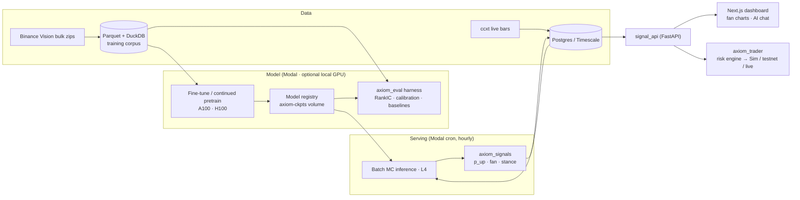

# Axiom

**A finance-native time-series foundation model (Kronos fork) + signal service + dashboard + paper-first trading loop.**

Axiom fine-tunes and extends [Kronos](https://github.com/shiyu-coder/Kronos) (Shi et al. 2025, MIT — see `NOTICE`) for crypto K-line forecasting, converts Monte-Carlo forecast paths into calibrated bull/bear probabilities, and serves them to a dashboard and a risk-gated trading loop. Built by one person; engineered like it will eventually route real money — because it might.

> **Status:** Phase 0 — Bootstrap · see [`TODO.md`](TODO.md) · plan: [`docs/AXIOM_BUILD_ORDER.md`](docs/AXIOM_BUILD_ORDER.md) · rules: [`CLAUDE.md`](CLAUDE.md)

## Architecture



## Quickstart (after `scaffold.sh`)

```bash
# 1) Python env (torch is installed per-machine, NOT via pyproject — see CLAUDE.md)
uv sync && source .venv/bin/activate
uv pip install torch --index-url https://download.pytorch.org/whl/cpu       # CPU-only laptop
# uv pip install torch --index-url https://download.pytorch.org/whl/rocm6.4 # AMD RX 7900 XTX box (check current tag)

# 2) Vendor upstream Kronos
git subtree add --prefix vendor/kronos https://github.com/shiyu-coder/Kronos master --squash

# 3) Sanity
uv run ruff check . && uv run pytest -q

# 4) Modal + GPU smoke test (no local GPU needed)
pip install modal && modal setup
modal run infra/modal_app/smoke.py
```

**No local GPU? No problem.** Every GPU task routes to Modal (`infra/modal_app/`): smoke on T4, subset fine-tunes on A10G/L4, full runs on A100, hourly signals on L4. A local GPU (the RX 7900 XTX) only speeds up iteration and adds the ROCm parity leg — it is never required.

Then work `TODO.md` top-to-bottom, starting at **P0-04**.

## Repository layout

| Path | Purpose |
|---|---|
| `configs/` | All experiment/universe/eval YAMLs — parameters live here, not in code |
| `packages/axiom_model` | Vendored+refactored Kronos core (tokenizer, transformer, predictor, registry, training) |
| `packages/axiom_data` | Download, Parquet store, resampling, QA, normalization, dataset builder |
| `packages/axiom_eval` | Metrics, baselines, walk-forward harness, reports |
| `packages/axiom_signals` | MC paths → probabilities/stances |
| `packages/axiom_trader` | Risk engine + broker adapters (Phase 8) |
| `infra/modal_app` | Modal smoke test, training, hourly-inference cron, API deployment |
| `services/signal_api` | Read-only FastAPI over Postgres |
| `apps/dashboard` | Next.js dashboard + AI SDK chat (Phase 7) |
| `db/schema.sql` | Postgres DDL |
| `docs/` | Build order, normalization spec, ROCm notes, decision memos |

## Benchmarks

| Runtime | Bench (50 sym × 64 MC × 24 steps) | Hardware | Date |
|---|---|---|---|
| baseline (pre-P4) | _TBD (P4-01)_ | Modal L4 (+ XTX/CPU reference) | — |
| `axiom-runtime-v1` | _TBD (P4-09)_ | Modal L4 (+ XTX/CPU reference) | — |

## Principles

Eval-first · parity on CPU + CUDA (ROCm leg for runtime releases) · test years are read-only · every number is net of costs · configs are law. Details in [`CLAUDE.md`](CLAUDE.md).

## License & attribution

Code: MIT (see `LICENSE`). Derived from Kronos — Shi et al., *"Kronos: A Foundation Model for the Language of Financial Markets"*, arXiv:2508.02739 (AAAI 2026), MIT — see `NOTICE`. Pretrained weights from Hugging Face `NeoQuasar` repos retain their original licenses.

**Disclaimer:** research/engineering project. Nothing here is investment, legal, or tax advice; forecasts are model output, not recommendations.