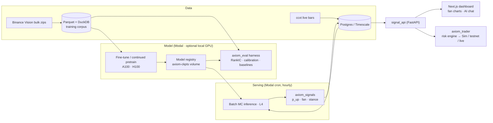

# Axiom

**A finance-native time-series foundation model (Kronos fork) + signal service + dashboard + paper-first trading loop.**

Axiom fine-tunes and extends [Kronos](https://github.com/shiyu-coder/Kronos) (Shi et al. 2025, MIT — see `NOTICE`) for crypto K-line forecasting, converts Monte-Carlo forecast paths into calibrated bull/bear probabilities, and serves them to a dashboard and a risk-gated trading loop. Built by one person; engineered like it will eventually route real money — because it might.

> **Status:** Phase 3 — Fine-tune · see [`TODO.md`](TODO.md) · plan: [`docs/AXIOM_BUILD_ORDER.md`](docs/AXIOM_BUILD_ORDER.md) · rules: [`CLAUDE.md`](CLAUDE.md)

## Architecture



## Quickstart (after `scaffold.sh`)

```bash
# 1) Python env (torch is installed per-machine, NOT via pyproject — see CLAUDE.md)
uv sync && source .venv/bin/activate
uv pip install torch --index-url https://download.pytorch.org/whl/cpu       # CPU-only laptop
# uv pip install torch --index-url https://download.pytorch.org/whl/rocm6.4 # AMD RX 7900 XTX box (check current tag)

# 2) Vendor upstream Kronos
git subtree add --prefix vendor/kronos https://github.com/shiyu-coder/Kronos master --squash

# 3) Sanity
uv run ruff check . && uv run pytest -q

# 4) Modal + GPU smoke test (no local GPU needed)
pip install modal && modal setup
modal run infra/modal_app/smoke.py
```

**No local GPU? No problem.** Every GPU task routes to Modal (`infra/modal_app/`): smoke on T4, subset fine-tunes on A10G/L4, full runs on A100, hourly signals on L4. A local GPU (the RX 7900 XTX) only speeds up iteration and adds the ROCm parity leg — it is never required.

Then work `TODO.md` top-to-bottom, starting at **P2-01**.

## Repository layout

| Path | Purpose |
|---|---|
| `configs/` | All experiment/universe/eval YAMLs — parameters live here, not in code |
| `packages/axiom_model` | Vendored+refactored Kronos core (tokenizer, transformer, predictor, registry, training) |
| `packages/axiom_data` | Download, Parquet store, resampling, QA, normalization, dataset builder |
| `packages/axiom_eval` | Metrics, baselines, walk-forward harness, reports |
| `packages/axiom_signals` | MC paths → probabilities/stances |
| `packages/axiom_trader` | Risk engine + broker adapters (Phase 8) |
| `infra/modal_app` | Modal smoke test, training, hourly-inference cron, API deployment |
| `services/signal_api` | Read-only FastAPI over Postgres |
| `apps/dashboard` | Next.js dashboard + AI SDK chat (Phase 7) |
| `db/schema.sql` | Postgres DDL |
| `docs/` | Build order, normalization spec, ROCm notes, decision memos |

## Data (Phase 1)

The corpus is Binance bulk history: 1m spot klines for a frozen 50-symbol USDT universe,
stored as partitioned Parquet and queried with DuckDB.

```bash
uv run axiom-data download --config configs/universe_v1.yaml    # monthly zips, CHECKSUM-verified, resumable
uv run axiom-data ingest   --config configs/data/crypto_v1.yaml # -> parquet, resampled to 15m/1h/4h
uv run axiom-data qa       --config configs/data/crypto_v1.yaml # gaps, dupes, OHLC sanity, coverage
uv run axiom-data build    --config configs/data/crypto_v1.yaml # splits + embargo + dataset hash
modal run infra/modal_app/download.py                           # the same, straight onto the Modal volume
```

Conventions that are load-bearing, all enforced by tests:

- **`ts` is the bar's close time.** Binance and ccxt label bars with their *open* time; ingest
  shifts them. A bar labeled with its close is complete at its label, so "context up to `ts`"
  never contains the future. Resampling is right-closed and right-labeled to match, and
  `pytest --network` checks our 1m→1h output against Binance's own 1h klines.
- **Normalization lives in one module** (`axiom_data.normalization`, spec in
  [`docs/normalization.md`](docs/normalization.md)), identical for training, eval and inference.
- **Splits are chronological with an embargo**: every window's context *and* horizon lie inside
  its own split, so no validation or test window can reach back into training bars. Test years
  are read-only.
- **The build is reproducible or it didn't happen**: `build` prints a dataset hash over the
  config plus the content of every bar it used, and refuses to run on a corpus that fails QA.
  The manifest (`data/datasets/{name}/manifest.json`) records the hash, git SHA and window
  counts per split.

## Evaluation (Phase 2)

`axiom-eval` is the frozen measuring stick: nothing about the model or the preprocessing changes
without before/after numbers from it. Full detail in [`docs/eval.md`](docs/eval.md).

```bash
uv run axiom-eval run --config configs/eval/default.yaml          # -> reports/{run_id}/
uv run axiom-eval run --config configs/eval/default.yaml     --models persistence ewma --timeframes 1h --max-anchors 4     # laptop smoke, no GPU
modal run infra/modal_app/eval.py                                 # the same run on an L4
```

- **RankIC** (cross-sectional Spearman + t-stat), **directional accuracy net of round-trip
  costs**, MAE/RMSE on log returns, and **calibration** of the MC fan (10–90 coverage + PIT),
  each sliced by year and realized-vol tercile.
- **The humiliation panel**: persistence, EWMA drift+vol and LightGBM are scored on exactly the
  same windows. If Axiom can't beat LightGBM net of costs, scaling is not the bottleneck.
- **Leakage rules are asserts, not intentions** — context and horizon inside the embargoed
  split, no window across a data gap, context-only normalization, ex-ante universe.
- Every run is reproducible from a committed YAML + git SHA + dataset hash, seeded per window
  so results don't depend on evaluation order or sharding.

First results are in [`docs/results/p2-zero-shot.md`](docs/results/p2-zero-shot.md): zero-shot
`axiom-zero-small` at 1h / 24 bars is the only cell in the grid with a RankIC t-stat above 2
(0.068, t = 2.56), ahead of LightGBM (0.005) and well ahead of persistence and EWMA (−0.083),
and the 102M model is worse than the 24.7M one nearly everywhere. The Monte-Carlo fan, however,
is badly miscalibrated — 10–90 coverage of 0.19–0.47 against a nominal 0.80 — so the probability
layer in Phase 6 is blocked until that is fixed. Both facts exist because the harness was built
before the model work, which is the entire point of building it first.

## Benchmarks

| Runtime | Bench (50 sym × 64 MC × 24 steps) | Hardware | Date |
|---|---|---|---|
| baseline (pre-P4) | _TBD (P4-01)_ | Modal L4 (+ XTX/CPU reference) | — |
| `axiom-runtime-v1` | _TBD (P4-09)_ | Modal L4 (+ XTX/CPU reference) | — |

## Principles

Eval-first · parity on CPU + CUDA (ROCm leg for runtime releases) · test years are read-only · every number is net of costs · configs are law. Details in [`CLAUDE.md`](CLAUDE.md).

## License & attribution

Code: MIT (see `LICENSE`). Derived from Kronos — Shi et al., *"Kronos: A Foundation Model for the Language of Financial Markets"*, arXiv:2508.02739 (AAAI 2026), MIT — see `NOTICE`. Pretrained weights from Hugging Face `NeoQuasar` repos retain their original licenses.

**Disclaimer:** research/engineering project. Nothing here is investment, legal, or tax advice; forecasts are model output, not recommendations.